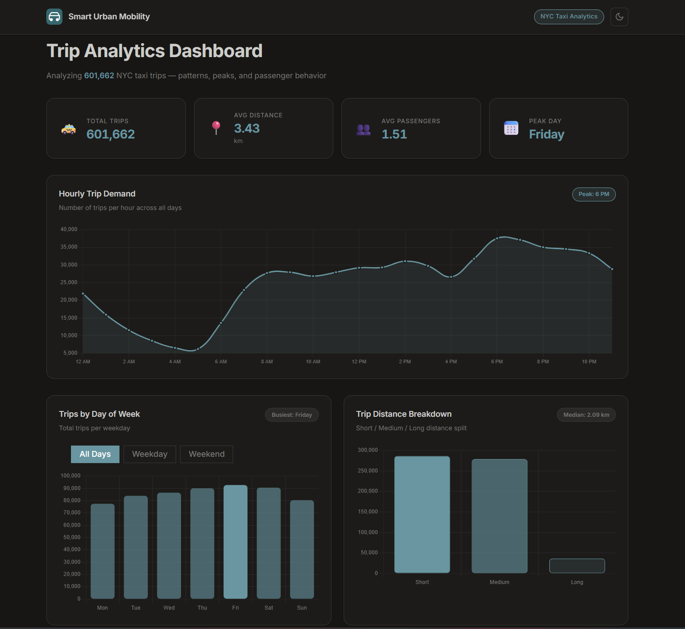
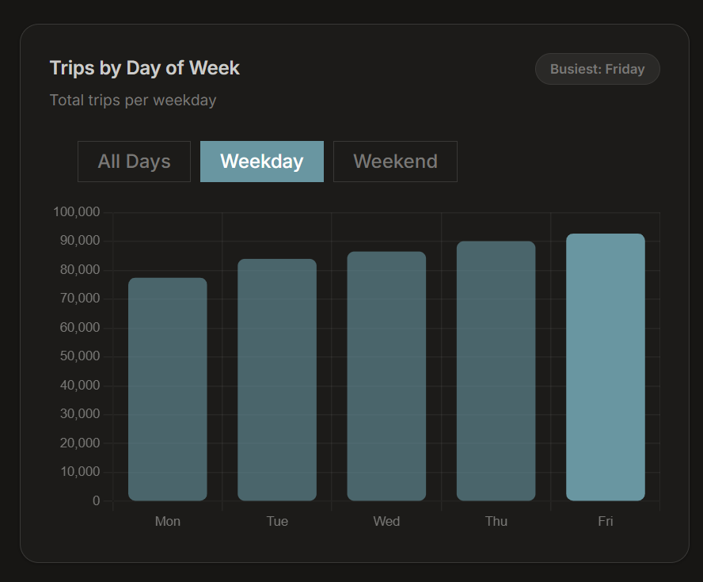
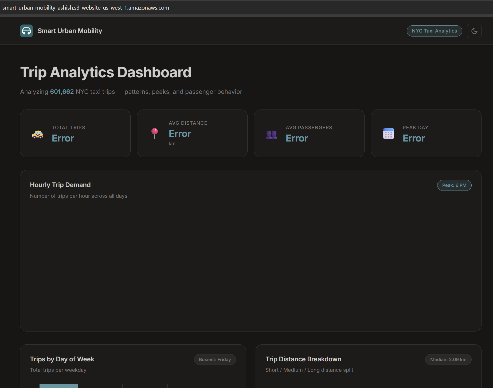
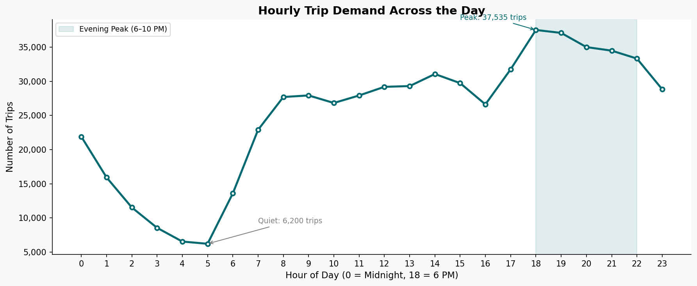
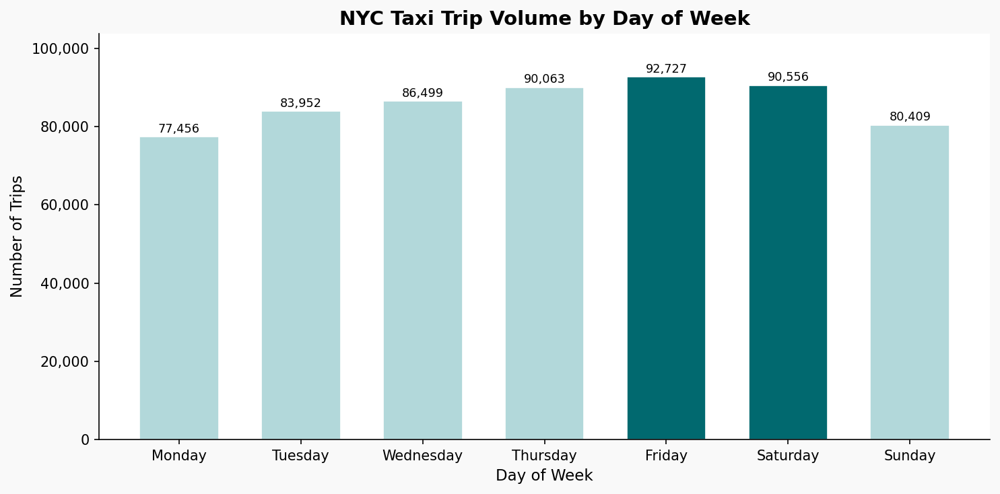
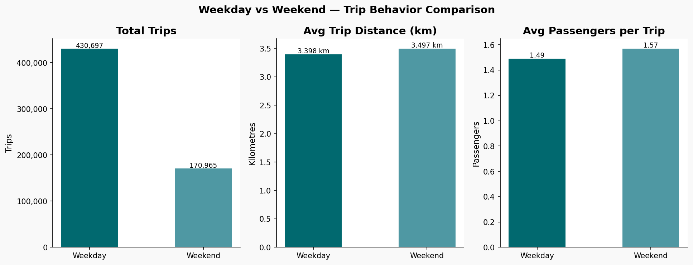
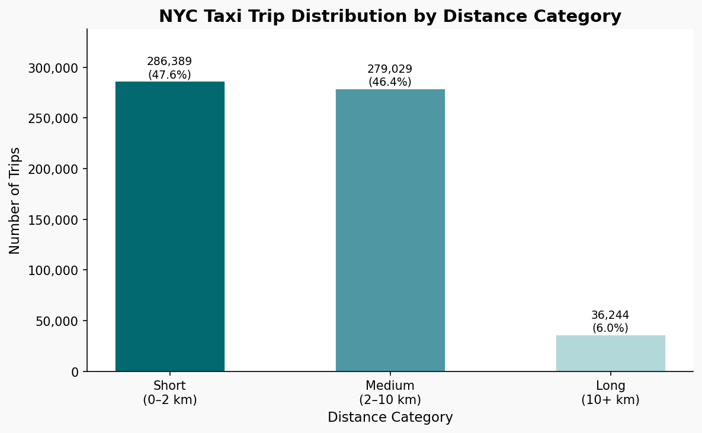
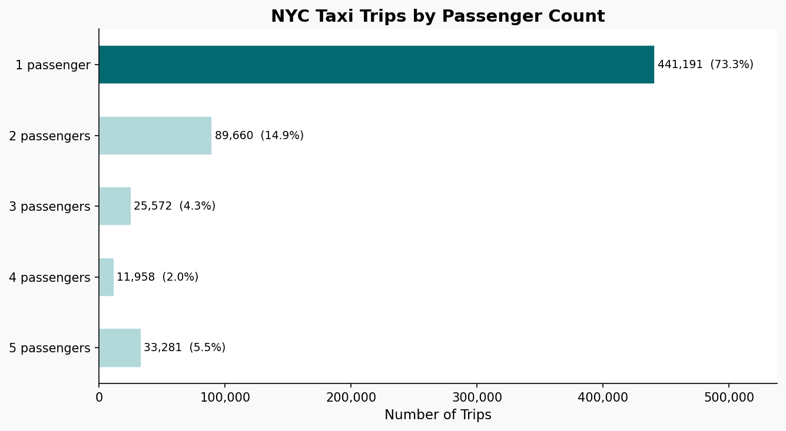

# 🚕 Smart Urban Mobility Analytics Dashboard

A full-stack data analytics project analyzing **601,662 NYC taxi trips** to uncover
peak hours, busy days, distance trends, and passenger behavior - built end-to-end
from raw data cleaning to a live cloud-hosted dashboard.

**Live Demo (AWS S3):** [smart-urban-mobility-ashish.s3-website-us-west-1.amazonaws.com](http://smart-urban-mobility-ashish.s3-website-us-west-1.amazonaws.com)
**Live Repository:** [github.com/tashishh/smart-urban-mobility-analytics](https://github.com/tashishh/smart-urban-mobility-analytics)

> Note: Full EC2 deployment is a planned next step.

---

## Project Goal

Build a complete end-to-end analytics system:
Raw CSV → Python Cleaning → MySQL Database → Flask API → Web Dashboard → AWS S3


The project analyzes real NYC taxi trip data to answer business questions like:
- When is taxi demand highest during the day?
- Which days of the week are busiest?
- Do weekday and weekend riders behave differently?
- What proportion of trips are short vs long distance?
- How do the two vendors compare?

---

## Dashboard Screenshots

### Full Dashboard View


### Interactive Weekday / Weekend Filter


### AWS S3 Hosted Frontend


---

## Tech Stack

| Layer | Technology |
|---|---|
| Data Cleaning & EDA | Python - Pandas, Matplotlib |
| Database | MySQL 8.0 |
| Backend API | Flask (Python), flask-cors |
| Frontend Dashboard | HTML, CSS, JavaScript, Chart.js |
| Cloud Hosting | AWS S3 (static frontend) |
| Version Control | Git & GitHub |

---

## Project Structure
```
smart-urban-mobility-analytics/
├── data/
│ ├── raw/ # Original dataset (not tracked in Git)
│ └── cleaned/ # taxi_cleaned.csv — ready for SQL import
├── analysis/ # Python EDA scripts and notebooks
├── sql/
│ ├── schema.sql # Table design and data types
│ ├── data_load.sql # LOAD DATA INFILE import script
│ ├── basic_queries.sql # Day 10 foundational SQL queries
│ ├── analytics_queries.sql # Day 11 business-focused SQL analytics
│ └── views.sql # Day 12 reusable summary views
├── backend/
│ ├── app.py # Flask API with 6 endpoints
│ └── requirements.txt
├── frontend/
│ ├── index.html # Dashboard layout
│ ├── style.css # Design tokens, dark/light theme
│ └── app.js # Chart.js charts, fetch calls, toggle filter
├── aws/
│ └── deployment_notes.txt # S3 setup steps and architecture notes
├── screenshots/ # Dashboard and analysis screenshots
└── docs/
├── project_overview.txt
├── column_notes.txt
├── cleaning_notes.txt
└── analysis_insights.txt
```

---

## Dataset

| Property | Detail |
|---|---|
| Source | [NYC Taxi Trip Duration — Kaggle](https://www.kaggle.com/c/nyc-taxi-trip-duration/data?select=test.zip) |
| Raw file | `data/raw/test.csv` |
| Raw rows | 625,134 trips |
| Cleaned rows | 601,662 trips (after removing invalid records) |
| Columns (raw) | 9 |
| Columns (final) | 14 (includes 5 engineered features) |

---

## Dataset Columns

| Column | Type | Description |
|---|---|---|
| id | VARCHAR | Unique trip identifier |
| vendor_id | TINYINT | Taxi company — 1 = CMT, 2 = VeriFone |
| pickup_datetime | DATETIME | Date and time of passenger pickup |
| passenger_count | TINYINT | Number of passengers (1–5) |
| pickup_longitude | DECIMAL | GPS longitude of pickup location |
| pickup_latitude | DECIMAL | GPS latitude of pickup location |
| dropoff_longitude | DECIMAL | GPS longitude of dropoff location |
| dropoff_latitude | DECIMAL | GPS latitude of dropoff location |
| store_and_fwd_flag | TINYINT | 0 = sent live, 1 = stored on tablet first |
| trip_distance_km | DECIMAL | Distance calculated from GPS (Haversine formula) |
| hour_of_day | TINYINT | Hour extracted from pickup_datetime (0–23) |
| day_of_week | VARCHAR | Day name (Monday–Sunday) |
| is_weekend | TINYINT | 1 = Saturday or Sunday, 0 = weekday |
| distance_bucket | VARCHAR | Short (0–2 km) / Medium (2–10 km) / Long (10+ km) |

---

## Data Cleaning Summary

| Issue | What Was Found | Fix Applied |
|---|---|---|
| Datetime stored as text | `pickup_datetime` had dtype `object` | `pd.to_datetime()` conversion |
| GPS coordinates outside NYC | Longitude as far as -121.93, latitude as low as 37.39 | Filtered to official NYC bounds |
| Impossible passenger counts | Values of 0 and up to 9 found | Kept only rows where count is 1–5 (NYC TLC rules) |
| store_and_fwd_flag as text | Stored as 'Y'/'N' strings | Converted to 1/0 integer for SQL storage |

**2,413 zero-distance trips** (immediate cancellations) were also removed during
feature engineering, bringing the final dataset to **601,662 rows**.

---

## Key Findings

### Hourly Demand


- **Peak hour:** 6 PM (18:00) → 37,535 trips - evening rush is the single busiest hour
- **Quietest hour:** 5 AM → only 6,200 trips
- Demand drops steadily from midnight to 5 AM, then climbs sharply from 6 AM onward

### Daily Demand


- **Busiest day:** Friday → 92,727 trips (19.7% more than Monday)
- Trip volume builds through the week and peaks Thursday-Saturday
- Monday is the quietest weekday at 77,456 trips

### Weekday vs Weekend Behavior


- Weekdays carry 430,697 trips total vs 170,965 on weekends
- Per-day demand is nearly identical (~86,000 trips/day each)
- Weekend trips are slightly longer (3.50 km vs 3.40 km avg)
- Weekend riders travel in groups more often — **30.24%** group rides vs **25.26%** on weekdays

### Distance Distribution


- **Short (0–2 km):** 286,389 trips - 47.6% of all trips
- **Medium (2–10 km):** 279,029 trips - 46.4% of all trips
- **Long (10+ km):** 36,244 trips - 6.0% (airport runs, max trip 41.55 km)
- Median trip distance is just **2.09 km** - NYC taxi use is dominated by short rides

### Passenger Count


- **73.3%** of all trips carry exactly 1 passenger — solo rides dominate
- 2-passenger trips are the second most common at 14.9%
- Only 6% of trips carry 3 or more passengers

---

## SQL Layer

- **Database:** `urban_mobility`
- **Table:** `trips` - 601,662 rows, 14 columns
- **Imported using:** MySQL command line with `LOAD DATA LOCAL INFILE`

### SQL Files

| File | Purpose |
|---|---|
| `schema.sql` | Table definition with correct data types |
| `data_load.sql` | CSV import script |
| `basic_queries.sql` | Counts, averages, groupings |
| `analytics_queries.sql` | Peak-hour analysis, vendor comparison, window functions |
| `views.sql` | 5 reusable summary views for Flask API |

### Reusable Views

| View | What It Returns |
|---|---|
| `hourly_summary` | Trips per hour with Peak/Shoulder/Off-Peak label |
| `weekday_summary` | Trips per day with weekday/weekend flag |
| `distance_summary` | Trips by Short/Medium/Long bucket |
| `vendor_summary` | Vendor 1 vs Vendor 2 breakdown |
| `weekend_summary` | Weekday vs Weekend KPI comparison |

### Key SQL Insights

- **Thursday 7-9 PM** is the single busiest 3-hour window in the dataset
- **Per-day trip demand is equal** on weekdays and weekends (~86,000 trips/day)
- **Shoulder hours carry 50%** of all trips - peak is intense but brief (7 hours)
- **Weekday = Short-dominant; Weekend = Medium-dominant** - a clear behavioral shift
- **Both vendors serve identical trip type distributions** - no specialization
- **Sunday midnight** is the only slot where the busiest hour is after 11 PM

---

## Flask API Endpoints

| Endpoint | Returns |
|---|---|
| `GET /api/kpis` | Total trips, avg distance, avg passengers, peak day |
| `GET /api/hourly-summary` | Trips per hour (0-23) |
| `GET /api/weekday-summary` | Trips per day of week |
| `GET /api/weekend-summary` | Weekday vs weekend KPI comparison |
| `GET /api/distance-breakdown` | Short / Medium / Long trip counts |
| `GET /api/vendor-comparison` | CMT vs VeriFone stats |

---

## Frontend Dashboard Features

- **Hourly line chart** - trip demand across 24 hours with AM/PM labels
- **Daily bar chart** - trips per day of week with busiest day highlighted
- **Distance bar chart** - Short / Medium / Long breakdown
- **Weekday vs Weekend table** - side-by-side comparison with group trip %
- **Vendor comparison cards** - CMT vs VeriFone trips, distance, passengers
- **Interactive toggle filter** - Weekday / Weekend / All Days on the daily chart
- **Dark / Light theme toggle** - persists across the session

---

## AWS Deployment

The frontend is hosted on **AWS S3** as a static website:
http://smart-urban-mobility-ashish.s3-website-us-west-1.amazonaws.com


| Component | Status |
|---|---|
| Frontend (HTML/CSS/JS) | ✅ Hosted on AWS S3 |
| Backend (Flask API) | ⚠️ Runs locally - EC2 deployment planned |
| Database (MySQL) | ⚠️ Runs locally - RDS migration planned |

---

## Setup Instructions

### Prerequisites
- Python 3.10+
- MySQL 8.0+
- Git

### 1 — Clone the Repository
```bash
git clone https://github.com/tashishh/smart-urban-mobility-analytics.git
cd smart-urban-mobility-analytics
```

### 2 — Set Up the Database
```bash
mysql -u root -p
CREATE DATABASE urban_mobility;
EXIT;
mysql -u root -p urban_mobility < sql/schema.sql
```

### 3 — Run the ETL Pipeline
```bash
cd analysis
pip install -r ../backend/requirements.txt
python load_data.py
```

### 4 — Start the Flask Backend
```bash
cd backend
python app.py
# API runs at http://127.0.0.1:5000
```

### 5 — Open the Dashboard
Open `frontend/index.html` in your browser.
Or visit the S3 URL while Flask is running on the same machine.

---

## Challenges & Solutions

| Challenge | Solution |
|---|---|
| Raw data had bad GPS, bad data types and invalid counts | Pandas cleaning pipeline with NYC boundary and TLC validation rules |
| Haversine distance calculation from GPS coordinates | Implemented vectorized Haversine formula in Python |
| Flask API not reachable from S3 | Documented as known limitation; `flask-cors` added; EC2 deployment planned |
| Chart.js toggle filter without re-fetching API | Stored full dataset in `allWeekdayData[]` and filtered in memory |
| S3 CORS blocking localhost requests | Learned browser security model; added `Access-Control-Allow-Origin` header |

---

## Future Improvements

- Deploy Flask backend to **AWS EC2** for full cloud hosting
- Migrate MySQL to **AWS RDS** for managed cloud database
- Add **CloudFront CDN** in front of S3 for HTTPS and global delivery
- Build **top routes analysis** using pickup/dropoff zone data
- Add **date range filter** to the dashboard
- Automate ETL pipeline with **Apache Airflow**

---

## Progress — 22 Days

- [x] Day 1 - Project setup and dataset understanding
- [x] Day 2 - GitHub repository initialized
- [x] Day 3 - Raw data inspection and issue log
- [x] Day 4 - Data cleaning and column standardization
- [x] Day 5 - Feature engineering (distance, time, buckets)
- [x] Day 6 - Exploratory data analysis (EDA)
- [x] Day 7 - Visual charts (5 charts created)
- [x] Day 8 - SQL database design and schema
- [x] Day 9 - Data import and validation (601,662 rows)
- [x] Day 10 - Basic SQL queries
- [x] Day 11 - Business-focused SQL analytics
- [x] Day 12 - Reusable SQL views
- [x] Day 13 - GitHub README polish
- [x] Day 14 - Database design refinement and normalization
- [x] Day 15 - Flask setup and database connection
- [x] Day 16 - Analytics API endpoints
- [x] Day 17 - Complete backend and error handling
- [x] Day 18 - Frontend layout and dark/light theme
- [x] Day 19 - Connect frontend to Flask API with Chart.js
- [x] Day 20 - Charts polish and interactive Weekday/Weekend filter
- [x] Day 21 - AWS S3 static frontend deployment
- [x] Day 22 - Final testing, README, and project handoff ✅

---

## Author

**Ashish Thapa**
Master's in Data Analytics - Webster University
GitHub: [@tashishh](https://github.com/tashishh)